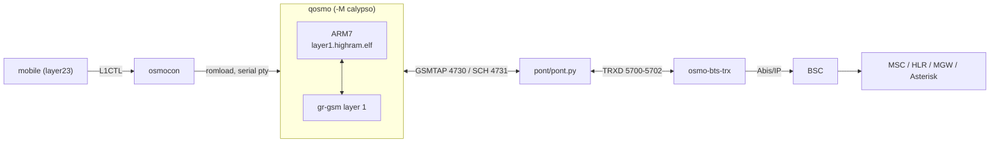
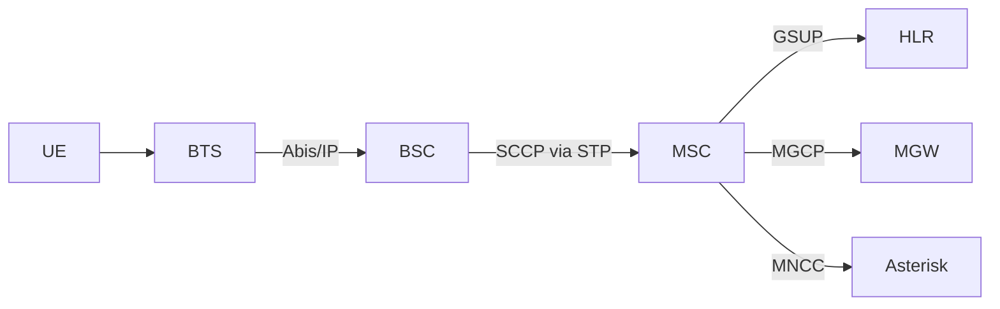
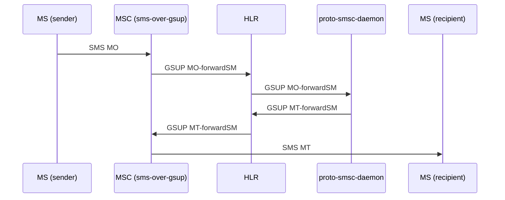
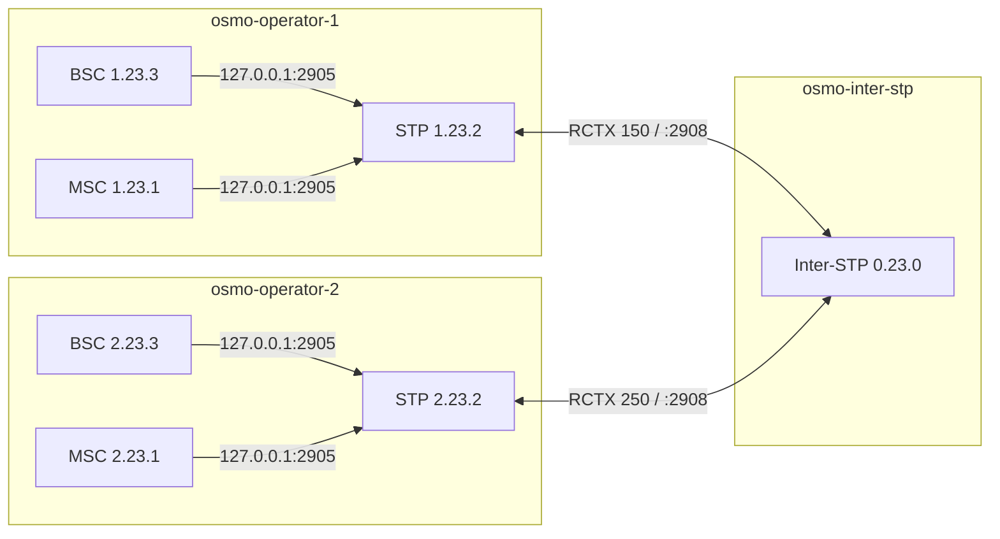
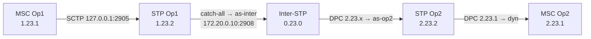

# osmo-operator — a full GSM network on one machine

A complete Osmocom GSM core (BTS, BSC, MSC, HLR, MGW, SMSC, Asterisk) plus an
**emulated Calypso handset** — no radio hardware, no SIM card, no phone. The
handset runs the real OsmocomBB `layer1` firmware on an emulated TI Calypso
baseband, camps on the cell, authenticates, ciphers, sends SMS and holds a
voice call.

Everything below is the **standalone bench**: one operator, one machine. That is
what you want first, and it is what most of this document is about. Multi-operator
SS7 interconnect exists and is covered in [§9](#9-multi-operator-and-ss7), but you
do not need it to get a phone on the air.

---

## 1. Quick start

### 1.1 From the published image

```bash
sudo docker pull bastienbaranoff/norf_gsm
sudo docker tag  bastienbaranoff/norf_gsm osmocom-nitb
git clone https://github.com/bbaranoff/osmo-operator
cd osmo-operator
sudo ./start.sh
```

Then enter the container and bring the stack up:

```bash
sudo docker exec -ti osmo-operator-1 bash

cd /opt/GSM/osmo-operator
./start-direct.sh --regen     # regenerate configs from the templates (first run)
./start-direct.sh --stop      # make sure nothing is left over
./start-direct.sh             # start the bench
```

`start-direct.sh` attaches to tmux at the end. You are looking at a live GSM
network with a mobile camped on it.

### 1.2 Native, without Docker

The repository installs directly on Ubuntu 24.04 (noble — the same base as the
Dockerfile):

```bash
sudo ./install.sh                  # everything: deps, sources, build, binaries, configs, desktop
./install.sh --list                # show the steps, do nothing
./install.sh --check               # what is already in place
sudo ./install.sh --reinstall      # replay everything
sudo ./install.sh --only bureau    # desktop icons and shortcuts only
```

The launcher is the same `./start-direct.sh`, which delegates to
`/opt/GSM/qosmo/run.sh`.

### 1.3 Stopping

```bash
./start-direct.sh --stop      # stops the stack AND the DSP bench, with or without --dsp
./start-direct.sh --status    # what is running
```

`--stop` never needs `--dsp` to be repeated: it tears down the C54x bench too,
so the next start finds a clean machine.

---

## 2. The two layer-1 chains

This is the one choice that matters on the standalone bench. Both run the same
core network, the same BTS and the same `mobile`; they differ in **who
demodulates the air interface**.

| | **`--grgsm`** (default) | **`--dsp`** |
|---|---|---|
| Layer 1 | gr-gsm inside QEMU + `grgsm_exe` bridge | real TI mask-ROM C54x, **outside** QEMU |
| QEMU's job | ARM7 + gr-gsm layer 1 | ARM7 only (`CALYPSO_DSP_EXTERN=1`) |
| Bridge | `pont/pont.py` | `pont/pont_dsp.py` |
| Status | end to end: camping, LU, auth, A5/1, SMS, voice call | camping, SI1-4, LU; TCH calls reach end to end but every speech frame is flagged `B_BFI` |
| Use it for | getting work done | studying the real DSP |

```bash
./start-direct.sh             # gr-gsm layer 1 (default)
./start-direct.sh --grgsm     # the same, explicitly
./start-direct.sh --dsp       # real C54x mask ROM
```

### 2.1 Three trees, one QEMU

Since 2026-09-25 there is a **single QEMU tree**. The old `qosmo-grgsm` and
`qosmo-dsp` forks are gone — they had no common root commit, so a platform fix
had to be reapplied by hand in the other tree and, in practice, was not.

| tree | what it is |
|---|---|
| [`/opt/GSM/qosmo`](https://github.com/bbaranoff/qosmO) | the QEMU fork: `-M calypso`, ARM7TDMI + platform. Carries `run.sh`, `run_modules/`, `cfgs/`. The layer 1 is a `configure` option, not a repository: `--enable-l1-grgsm` or `--enable-l1-dsp`. |
| [`/opt/GSM/c54x_exe`](https://github.com/bbaranoff/c54x_exe) | the TMS320C54x running **outside** QEMU on the real TI mask ROM (`rom/calypso_dsp.*.bin`). Compiles `qosmo`'s sources — it does not copy them. |
| [`/opt/GSM/grgsm_exe`](https://github.com/bbaranoff/grgsm_exE) | the gr-gsm layer 1 outside QEMU. 118 KB against the 93 MB `qemu-system-arm` that normally hosts it. |

`qemu-system-arm -M help` names the layer 1 actually linked in — the shortest way
to know what you built:

| configure | `-M help` shows |
|---|---|
| (nothing) | `couche 1 : aucune` |
| `--enable-l1-grgsm` | `couche 1 : grgsm` |
| `--enable-l1-dsp` | `couche 1 : c54x` |

### 2.2 The gr-gsm chain (default)



### 2.3 The DSP chain (`--dsp`)

`--dsp` does **not** select a different QEMU. The stack comes up exactly as in
gr-gsm mode — core, BTS, side-car, tmux — and only the four Calypso modules
(`qemu`, `pty`, `osmocon`, `l2`) are handed over to `c54x_exe/run.sh`, which runs
five steps of its own:

```
1. c54x_exe --arm     the DSP: /tmp/calypso_dsp.sock + shared API RAM,
                      DL bursts on UDP 6702
2. qemu-system-arm    the ARM + osmocom-bb layer1, gr-gsm layer 1 cut out
3. osmocon            romload on the serial pty, L1CTL relay
4. mobile             osmocom-bb layers 2/3
5. pont_dsp.py        TRXD 5700-5702 facing osmo-bts-trx, bursts down to the
                      DSP, uplink through the /dev/shm side-bands
```

```bash
./start-direct.sh --dsp                   # the full stack, then the DSP bench
MODE=dsp PONT=1 /opt/GSM/c54x_exe/run.sh  # the mobile chain alone, no network
BANC_DSP=none ./start-direct.sh --dsp     # the stack only, no DSP bench
```

`--dsp` starts **no bridge of its own**: `c54x_exe/run.sh` runs its own on
5700-5702 (step 5). A second one on the same ports would die on *Address already
in use* and leave a corpse behind at every start.

Step details and variables: [`wiki/Start-direct.md`](wiki/Start-direct.md) § 8-dsp.

### 2.4 Profiles

The layer-1 flag is independent of the **profile**, which chooses how many
base stations come up and how:

| profile | stack |
|---|---|
| `faketrx-qemu` (default) | core + BTS#0 QEMU + BTS#1 faketrx — also `hybrid` |
| `faketrx` | core + `fake_trx` + `trxcon` + `mobile` |
| `qemu` | the Calypso QEMU pipeline alone |
| `noproc` | core only — also `core` |

```bash
./start-direct.sh faketrx
./start-direct.sh --profile qemu
./start-direct.sh --list        # show the plan without running it
./start-direct.sh --dry-run     # walk through it with no side effects
```

---

## 3. Building the images

```bash
sudo ./build.sh                # build osmocom-nitb (apt-fast, compose v2, .deb cache)
sudo ./build.sh --no-cache     # recompile everything and rewrite the cache
sudo ./build.sh --arch=arm64   # cross-build through buildx + qemu-user-static
```

### 3.1 The build is a graph, not a chain

`Dockerfile` is split into BuildKit stages, so the long compilations that have
nothing to do with each other run **at the same time**:

```
                 base   (apt, apt-fast, osmo-deb, configs)
                   |
        +----------+--------+---------+
    osmo-core    qemu      lte      node        <- IN PARALLEL
        |          |
   +----+-----+    |
  bb  grgsm-venv  l1
   +----+-----+---+
             |
       osmocom-nitb   (assembly)
             |
           debs       (FROM scratch: the .deb cache, for CI)
```

`bb`, `l1` and `grgsm-venv` are deliberately **not** parallel to `osmo-core`:
`osmocom-bb` links `mobile`/`trxcon` against libosmocore, `c54x_exe` asks
`pkg-config` for `libosmocoding libosmocore`, and gr-gsm's CMake looks for both.
Pulling them out would break the build, not speed it up.

`--target osmocom-nitb` is **mandatory** — `debs` is the last stage in the file,
so without it Docker builds an empty image. `build.sh` and `compose.yaml` already
pass it.

### 3.2 The `.deb` cache

Everything the image compiles (libosmocore, osmo-\*, gapk, QEMU and its tree,
osmocom-bb, the gr-gsm venv, the firmware) comes out as a `.deb` through
`packaging/osmo-deb.sh` and stays **on the host**, in `/var/cache/osmo-debs`
(`OSMO_DEB_CACHE` to move it):

```bash
sudo ./build.sh              # 1st build: everything compiles, .deb go to the cache
sudo ./build.sh              # rebuild: dpkg -i, nothing compiles
sudo ./build.sh --no-cache   # recompile everything, rewrite the cache
./compose.sh debs            # what is in the cache
```

Each package carries **both** the installed files and the `/opt/GSM` source tree,
so a cached rebuild still gives you a workshop you can read, patch and `make` in —
not an image where only `/usr/local` survives. That property is also what lets the
build stages hand their work to the assembly stage.

Standalone `.deb`, to install without git:

```bash
./packaging/build-debs.sh          # -> packaging/dist/
sudo dpkg -i packaging/dist/*.deb  # refuses to install over a git clone at the same path
```

### 3.3 Docker Compose

```bash
sudo ./compose.sh build [--no-cache] [--lite] [--stp]
sudo ./compose.sh up [--ms 2] [--phy faketrx]    # hub + osmo-operator-1, HLR populated
sudo ./compose.sh down | ps | logs | shell
```

### 3.4 ISO images

`sudo ./build-iso.sh` does **one** docker build (`osmocom-nitb`) and derives each
rootfs from it: interstp, normal, lite (the normal one with the workshops
removed), desktop. On the installed disk the accounts are the ones from the
Calamares *Users* screen plus an unlocked root; LUKS is offered in the
partitioning choices; a *Graphics drivers* page offers `nvidia-driver-610` when
`lspci` sees a card.

---

## 4. Daily use

### 4.1 tmux

```bash
docker exec -ti osmo-operator-1 tmux attach
docker exec -ti osmo-operator-1 tmux -S /tmp/osmocom_tmux attach -t osmocom
```

| key | window |
|---|---|
| `Ctrl-b 0` | faketrx |
| `Ctrl-b 1` | MS1 (trxcon + mobile) |
| `Ctrl-b 2` | Asterisk |
| `Ctrl-b 3` | SMSC (proto-smsc-daemon + relay) |
| `Ctrl-b w` | list all windows |
| `Ctrl-b d` | detach |

`--no-attach` starts without attaching — that is what `osmo-banc.service` uses,
since nobody is in front of it.

### 4.2 VTY

| port | component |
|---|---|
| `4239` | OsmoSTP |
| `4242` | OsmoBSC |
| `4243` | OsmoMGW |
| `4254` | OsmoMSC |
| `4258` | OsmoHLR |

```
OsmoMSC# show subscriber all
OsmoMSC# subscriber msisdn 10001 sms sender msisdn 10002 send Hello

OsmoHLR# subscriber imsi 001010000000001 show
OsmoHLR# show gsup-clients
```

Subscribers are provisioned automatically when the stack comes up, by
`run_modules/21-abonnes-hlr.sh` — there is nothing to run by hand. How many it
creates follows the numbering plan, and `--regen` re-applies it.

### 4.3 Ports on the wire

| port | carries |
|---|---|
| `5700-5702` UDP | TRXD, between `osmo-bts-trx` and the bridge |
| `4729` UDP | GSMTAP, the Um interface |
| `4730` UDP | full SI set into the shunt (`si_bridge.py`) |
| `4731` UDP | SCH BSIC/FN out of the gr-gsm receiver |
| `6702` UDP | DL bursts into the DSP BSP (`--dsp`) |
| `8080` TCP | the web dashboard (`osmo-egprs-web`) |

### 4.4 Wireshark

Started automatically on the Docker bridge with `sctp or udp port 4729`.

```
gsmtap                    # radio traffic (Um)
gsm_map                   # MAP messages
m3ua / sccp               # SS7, if you run multi-operator
```

---

## 5. Diagnosing the radio side

**Read [`pont/README.md`](pont/README.md) before chasing a radio fault through a
CRC counter.** The causes documented there — overwritten Kc, the SACCH L1 header,
C0 filling, an inert `CALYPSO_CANNED` — *all* present themselves as "the bridge
has CRC errors".

```bash
./start-direct.sh --check-paths     # verify the declared dependencies
./start-direct.sh --verbose         # show the modules' output
```

Logs:

```
/var/log/osmocom/qemu.log        # ARM/DSP emulation, BSP, IRQ
/var/log/osmocom/bridge.log      # QEMU ticks, IND CLOCK, DL/UL bursts
/var/log/osmocom/run.sh.log      # orchestration
```

| symptom | likely cause | check |
|---|---|---|
| `bridge: timeout` | QEMU never started the TPU/DSP | `grep TINT0 /var/log/osmocom/qemu.log` |
| `FBSB result=255` (no cell) | layer 1 is not detecting the FB | `grep "IMR change" /var/log/osmocom/qemu.log \| wc -l` |
| `osmo-bts-trx: PC clock skew too high` | the bridge stopped sending `IND CLOCK` | restart the bridge |
| `/tmp/osmocom_l2` never created | the firmware is not booting | `head -50 /var/log/osmocom/qemu.log` |
| *Address already in use* on 5700 | two bridges — a `--dsp` run left one behind | `./start-direct.sh --stop` |

QEMU monitor:

```bash
docker exec -ti osmo-operator-1 socat - unix-connect:/tmp/qemu-calypso-mon.sock
```

`--assembly-logs` gives an instruction trace of the emulated ARM
(`-d in_asm,exec,nochain`). It is very large and the bench no longer runs in real
time — use it when you are chasing the firmware, not when you are running the
network.

---

## 6. The `qosmo` launcher

`40-qemu.sh` does not call `qemu-system-arm` directly: it calls the C launcher
`qosmo`, installed next to it by `ninja install`. The launcher knows which layer 1
the QEMU it starts was built with, because `QOSMO_DSP` follows the `configure`
option — nobody has to tell it twice.

```bash
qosmo -k /opt/GSM/firmware/board/compal_e88/layer1.highram.elf
qosmo --help
```

Defaults are the ones that already work: `-M calypso`, `-cpu arm946`,
`-gdb tcp::1234`, `-serial pty -serial pty`, a unix monitor, L1CTL on
`/tmp/osmocom_l2`, TRXDv0 on `0.0.0.0:6702`. It reads `l1s`/`last_rach` out of the
ELF (no `nm` needed), relays QEMU's output unchanged, and publishes stable links
to the ptys under `<RUN_DIR>/`.

`start-direct.sh` resolves it (`--launcher <bin>`, or `QOSMO_LAUNCHER`), builds it
if the source is there and the binary is not, and passes it to `run.sh`. Without a
launcher, `40-qemu.sh` falls back to the historical `qemu-system-arm` command line.

---

## 7. One PLMN

Every simulated operator is the standard Osmocom stack, all components in a single
container talking over `127.0.0.1`.



The local STP is the intra-PLMN signalling hub. It listens on `127.0.0.1:2905`
immediately, without waiting for the Docker interface — which is attached after
the container starts, and used to be a race condition.

### 7.1 SMS



### 7.2 Voice

```
MS → BTS → BSC → MSC → MNCC → Asterisk → MNCC → MSC → BSC → BTS → MS
                              ↕ MGCP
                            OsmoMGW (RTP)
```

### 7.3 Numbering

| number | use |
|---|---|
| `N0001`…`N9999` | GSM subscribers of operator N |
| `100` / `200` | local softphones |
| `600` | echo test |
| `9XXXXX` | inter-operator out from a softphone |

The first digit of `NXXXX` identifies the operator. The `[gsm_in]` dialplan works
out on its own whether the destination is local or inter-op.

---

## 8. PHY modes

For the MS side, selected through `PHY_MODE` inside the container before calling
`run.sh`:

| `PHY_MODE` | stack | use |
|---|---|---|
| `faketrx` (default) | `fake_trx` → `trxcon` → `mobile` | multi-MS, fast, no DSP |
| `virtphy` | `osmo-bts-virtual` ↔ `virtphy` ↔ `mobile` | multi-MS over UDP multicast |
| `qemu` | `osmo-bts-trx` ↔ bridge ↔ Calypso QEMU ↔ `mobile` | emulated baseband, 1 MS |

`PHY_MODE=qemu` forces `N_MS=1`: the bridge uses fixed UDP ports, so one emulated
Calypso per container. For several virtual handsets, run several containers.

---

## 9. Multi-operator and SS7

Everything above is one operator. The bench also runs **N operators (1 to 9)**,
each with its own core network in its own container, joined by a central Inter-STP
that routes M3UA/SCCP between them. No configuration file is edited by hand: pjsip,
dialplan, SMS routing and the inter-STP config are all generated from N.

```bash
sudo ./start.sh          # choose bridge mode, enter N operators
sudo ./start.sh stop
```

This is essentially a *DHCP for SS7* — the inter-operator SS7 setup normally done
by hand, automated and reproducible.

### 9.1 Topology



### 9.2 Addressing

| Docker network | range | role |
|---|---|---|
| `gsm-inter` | `172.20.0.0/24` | interop backbone (inter-STP M3UA) |
| `gsm-net-opN` | `172.20.N.0/24` | operator N private network |

Operator N → backbone `172.20.0.(10+N)`, private `172.20.N.10`. The Inter-STP is
at `172.20.0.10`.

### 9.3 Point codes and routing contexts

ITU 14-bit, `zone.network.node`:

| node | point code | | RCTX | formula |
|---|---|---|---|---|
| Inter-STP | `0.23.0` | | `rctx_msc` | `N×100+10` |
| MSC OpN | `N.23.1` | | `rctx_stp` | `N×100+20` |
| STP OpN | `N.23.2` | | `rctx_bsc` | `N×100+30` |
| BSC OpN | `N.23.3` | | **`rctx_inter`** | **`N×100+50`** |

`rctx_inter` is the critical one: it must match in the operator's `osmo-stp.cfg`
and be consistent with the connection to the inter-STP.

The inter-STP uses **AS without a routing key** (catch-all per operator);
routing is on the DPC alone.

### 9.4 Message path



### 9.5 Generated configuration

`apply_config_templates()` in `start.sh` resolves every N-dependent placeholder in
a **single `sed` pass** (`__PC_MSC__`, `__RCTX_INTER__`, `__ARFCN__` = `512+N×2`,
`__CONTAINER_IP__`, …), then appends the sections that depend on the *total* number
of operators: N-1 PJSIP trunks, the `[interop_out]` dialplan, the SMS routing
table, and N AS + N×3 SS7 routes in the inter-STP config.

Startup order is critical — the Inter-STP must be listening on `:2908` **before**
the operator STPs try to connect.

### 9.6 Inter-operator SMS and voice

`sms-interop-relay.py` watches the `proto-smsc-daemon` MO log, parses the GSM 03.40
TPDU, looks up `sms-routing.conf` (longest-prefix match) and forwards over TCP 7890
to the target operator's relay, which resolves MSISDN→IMSI on the HLR VTY and calls
`proto-smsc-sendmt`.

Voice crosses on a SIP trunk between the operators' Asterisk instances. The
`[interop_out]` dialplan routes on the first digit of the dialled number.

### 9.7 Diagnosing PROHIB routes

```bash
sudo docker ps | grep inter-stp
sudo docker exec osmo-operator-1 sh -c 'echo "show cs7 instance 0 asp"   | telnet 127.0.0.1 4239'
sudo docker exec osmo-inter-stp  sh -c 'echo "show cs7 instance 0 asp"   | telnet 127.0.0.1 4239'
sudo docker exec osmo-operator-1 sh -c 'echo "show cs7 instance 0 route" | telnet 127.0.0.1 4239'
sudo docker exec osmo-operator-1 ping -c1 172.20.0.10
```

A healthy operator STP route table:

```
N.23.1/14   as-dyn-…  avail  avail  dyn   ← MSC (dynamic)
N.23.3/14   as-dyn-…  avail  avail  dyn   ← BSC (dynamic)
0.0.0/0     as-inter  avail  avail        ← catch-all to the inter-STP
```

| symptom | likely cause | fix |
|---|---|---|
| route `0.0.0/0` PROHIB | inter-STP down, or wrong IP | check `INTER_STP_IP` and the backbone IP |
| no dynamic routes | MSC/BSC not reaching the local STP | check the ASPs point at `127.0.0.1` |
| ASP DOWN on the inter-STP | Docker race condition | `docker restart` the operator |

### 9.8 WAN, mesh and multi-machine

Beyond a single host, `start-direct.sh` also meshes several machines:

```bash
./start-direct.sh --wan                   # interactive: N nodes, IPs, prefixes
./start-direct.sh --wan mynode1.conf       # from other nodes' cards
./start-direct.sh --wan-nodes "1:IP:IND …" # scriptable
./start-direct.sh --gen-conf               # write this node's card, start nothing
./start-direct.sh --virtualbox=3           # mesh with VirtualBox VMs
./start-direct.sh --air-mesh               # mesh the BURSTS: a shared radio medium,
                                           # a mobile can hear and pick another node's BTS
```

`--node N` picks the node number **at launch**, not at build time, so one ISO
serves all nine nodes.

---

## 10. Other extensions

**4G (srsRAN + Open5GS)** — shipped in `/opt/LTE`, launched with `osmo-lte` and
`osmo-epc`. CSFB to the 2G core through SGs.

**Web dashboard** — `osmo-egprs-web` on `:8080`, started by
`systemctl restart osmo-egprs-web`.

**postmarketOS handset UI** — a patched `pmbootstrap` in `/opt/user_interface/pmos`.

---

## 11. Related documents

| document | subject |
|---|---|
| [`pont/README.md`](pont/README.md) | **A5 ciphering, Kc and SACCH** — a measurement report. Read it before chasing a radio fault through a CRC counter. |
| [`wiki/`](wiki/Home.md) | Home, Build, Environment, Start-direct, Results — using the bench day to day |
| [`environment/README.md`](environment/README.md) | environment variables and path resolution |
| [`services/README.md`](services/README.md) | the systemd units shipped |
| [`navigation/QUICKSTART.md`](navigation/QUICKSTART.md) | getting started |
| [`qosmo/README.md`](https://github.com/bbaranoff/qosmO) | the QEMU fork: one base, two layer 1s |

---

*osmo-operator — a teaching and research GSM bench: a full core network and an
emulated Calypso handset on one machine, with multi-operator SS7 interconnect when
you want it.*
